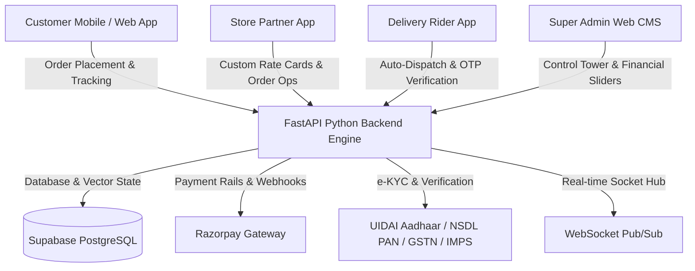

# 🧺 QuickPress — Comprehensive Master PRD & TRD Architecture Report
**Hyperlocal On-Demand Laundry, Dry Cleaning & Multi-Role Operating Ecosystem**

---

## 📌 1. Executive Summary & System Overview

**QuickPress** is an enterprise-grade, end-to-end hyperlocal on-demand fabric care and laundry platform. The system operates on a multi-role distributed architecture consisting of **4 client applications** powered by an asynchronous **FastAPI Python backend**, **Supabase PostgreSQL database**, real-time **WebSockets**, government-grade **e-KYC verification rails**, and a **Master Financial & Unit Economics Engine**.



---

## 📱 2. Multi-App Ecosystem & Roles

| Application | Technology Stack | Primary Function & Responsibilities | Build Status |
|---|---|---|---|
| **Customer App** | TanStack Start / React 19 / Vite / TailwindCSS / Capacitor | Geofenced store discovery (<8km), viewing partner custom rate cards, smart cart with per-kg/pc pricing, Express turnaround (+35%), Razorpay checkout, live order tracking, SLA guarantees. | **100% BUILT**<br/>(`QuickPress-Customer.apk`) |
| **Store Partner App** | TanStack Start / React 19 / Capacitor / Lucide / Sonner | Paperless onboarding with UIDAI Aadhaar OTP e-KYC modal, PAN/GSTIN/Bank verification, custom rate card pricing upload, 60s order acceptance countdown, order processing stages, dispatch OTPs. | **100% BUILT**<br/>(`QuickPress-Partner.apk`) |
| **Delivery Rider App** | TanStack Start / React 19 / Capacitor / Geolocation | Aadhaar/DL verification, auto-dispatch ping card (30s timer), atomic swipe-to-accept, 4-digit pickup/drop OTP security rail, daily incentive quest progress, wallet & payouts. | **100% BUILT**<br/>(`QuickPress-Rider.apk`) |
| **Super Admin CMS** | React 19 / Vite / TailwindCSS / REST API | Global operations telemetry, partner/rider KYC approvals, live financial slider overrides (commissions, delivery fees, GST), order manual override, double-entry audit. | **100% BUILT**<br/>(`/admin-frontend`) |
| **FastAPI Backend** | Python 3.12 / AsyncPG / Supabase PostgreSQL / WebSockets | 75+ REST endpoints, order lifecycle state machines, auto-assignment engine, master financial computation engine, Razorpay HMAC webhooks. | **100% BUILT**<br/>(`/backend-python`) |

---

## 📋 3. Product Requirements Document (PRD)

### 3.1 Customer Experience Flow
1. **Hyperlocal Store Discovery**:
   - Customer enters their location (GPS geocode or address search).
   - Backend performs haversine distance filtering (<8 km) and returns open/closed partner stores.
2. **Store-Level Custom Rate Cards**:
   - Customer browses a partner's service catalog and sees the **custom price set by that specific partner** (e.g. Wash & Fold @ ₹69/kg or ₹79/kg, Steam Iron @ ₹19/pc).
3. **Smart Cart & Add-ons**:
   - Dynamic cart calculation supporting weight-based items (kg), piece rate cards, and **+35% Express Surcharge** for 24-hr turnaround.
   - Automatic free delivery threshold applied for orders $\ge ₹499$ (or $\ge ₹199$ for Plus Members).
4. **Checkout & Payment**:
   - Razorpay Payment Gateway (UPI Intent, GooglePay, Cards, NetBanking), QuickPress Wallet, or Pay on Delivery.
5. **Real-time Order Tracking & SLA Guarantee**:
   - 6-stage lifecycle tracking with live rider phone call action and 4-digit pickup/drop OTP display.
   - **Late Delivery SLA**: If delivery is delayed >60 minutes beyond promised ETA, system auto-credits **₹50 QuickPress Wallet Cashback**.

### 3.2 Store Partner Workflow & Custom Rate Cards
1. **Paperless Onboarding & Verification**:
   - Step 1: Business details + **UIDAI Aadhaar OTP Modal e-KYC** (auto-fills name, photo, address, DOB).
   - Step 2: **NSDL PAN Verification** + **GSTIN Check** + **₹1 IMPS Penny Drop Bank Verification**.
   - Step 3: **Custom Service Pricing Upload**: Partner sets their own custom price (₹) and turnaround time for every service.
2. **Order Processing Pipeline**:
   - New order triggers audio ping + **60-second acceptance countdown timer**.
   - Partner updates order status: `Accepted` $\rightarrow$ `Picked Up` $\rightarrow$ `In Processing` $\rightarrow$ `Ready for Delivery`.
3. **Transparent Earnings & Settlements**:
   - Tiered commission structure (18% for <100 orders, 15% for 100-300 orders, 12% for >300 orders).
   - 1% Section 194-O TCS deducted and segregated for government compliance.

### 3.3 Delivery Rider Partner Ecosystem
1. **Rider Onboarding & Verification**:
   - Aadhaar OTP verification, Driving License validation, Vehicle RC verification, and emergency contact registry.
2. **Auto-Assignment Ping Card**:
   - Instant popup offer card with **30-second countdown timer**, pickup/drop distance display, estimated earnings breakdown, and atomic swipe-to-accept.
3. **4-Digit OTP Security Rail**:
   - Rider must input customer's 4-digit pickup OTP before taking garments.
   - Rider must input customer's 4-digit delivery OTP before handing over freshly processed garments.
4. **Daily Milestone Quests & Surge Bonuses**:
   - 5 Trips $\rightarrow$ **+₹100 Cash Bonus**
   - 10 Trips $\rightarrow$ **+₹250 Cash Bonus**
   - 15 Trips $\rightarrow$ **+₹450 Cash Bonus**
   - Weekly 50-Trip Mega Streak $\rightarrow$ **+₹800 Weekly Bonus**
   - Rain Surge (+₹20 to +₹35) & Night Surge (+₹25).

---

## ⚙️ 4. Technical Requirements Document (TRD)

### 4.1 Supabase PostgreSQL Database Schema

```sql
-- 1. Users Table (Customer, Partner, Rider, Admin)
CREATE TABLE users (
    _id VARCHAR(64) PRIMARY KEY,
    phone VARCHAR(20) UNIQUE NOT NULL,
    role VARCHAR(20) DEFAULT 'customer',
    name VARCHAR(100),
    email VARCHAR(100),
    is_active BOOLEAN DEFAULT TRUE,
    created_at TIMESTAMP WITH TIME ZONE DEFAULT NOW()
);

-- 2. Partner Profiles & Store Settings
CREATE TABLE partner_profiles (
    _id VARCHAR(64) PRIMARY KEY,
    business_name VARCHAR(150) NOT NULL,
    owner_name VARCHAR(100),
    phone VARCHAR(20) NOT NULL,
    city VARCHAR(50) DEFAULT 'Kasganj',
    latitude DOUBLE PRECISION,
    longitude DOUBLE PRECISION,
    is_online BOOLEAN DEFAULT TRUE,
    is_verified BOOLEAN DEFAULT FALSE,
    tier VARCHAR(20) DEFAULT 'Silver',
    rating NUMERIC(2,1) DEFAULT 5.0,
    created_at TIMESTAMP WITH TIME ZONE DEFAULT NOW()
);

-- 3. Partner Custom Services & Rate Cards
CREATE TABLE partner_services (
    _id VARCHAR(64) PRIMARY KEY,
    partner_id VARCHAR(64) REFERENCES partner_profiles(_id),
    name VARCHAR(100) NOT NULL,
    price NUMERIC(10,2) NOT NULL,
    unit VARCHAR(20) DEFAULT 'kg',
    turnaround_hours INT DEFAULT 24,
    is_active BOOLEAN DEFAULT TRUE
);

-- 4. Customer Orders & Financial Snapshots
CREATE TABLE customer_orders (
    _id VARCHAR(64) PRIMARY KEY,
    user_id VARCHAR(64) REFERENCES users(_id),
    partner_id VARCHAR(64) REFERENCES partner_profiles(_id),
    rider_id VARCHAR(64),
    status VARCHAR(30) DEFAULT 'pending',
    items JSONB NOT NULL,
    totals JSONB NOT NULL,
    financial_snapshot JSONB NOT NULL,
    otp JSONB NOT NULL,
    created_at TIMESTAMP WITH TIME ZONE DEFAULT NOW()
);

-- 5. Rider Fleet Telemetry & Deliveries
CREATE TABLE rider_profiles (
    _id VARCHAR(64) PRIMARY KEY,
    name VARCHAR(100) NOT NULL,
    phone VARCHAR(20) UNIQUE NOT NULL,
    is_online BOOLEAN DEFAULT FALSE,
    latitude DOUBLE PRECISION,
    longitude DOUBLE PRECISION,
    completed_trips INT DEFAULT 0,
    rating NUMERIC(2,1) DEFAULT 5.0
);

-- 6. Immutable Double-Entry Financial Ledger
CREATE TABLE wallet_ledger (
    _id VARCHAR(64) PRIMARY KEY,
    account_id VARCHAR(64) NOT NULL,
    amount NUMERIC(10,2) NOT NULL,
    direction VARCHAR(10) NOT NULL, -- 'credit' or 'debit'
    category VARCHAR(50) NOT NULL, -- 'trip_fare', 'commission', 'payout', 'incentive'
    reference_id VARCHAR(64),
    created_at TIMESTAMP WITH TIME ZONE DEFAULT NOW()
);
```

### 4.2 Master Financial Computation Logic (`financial_engine.py`)

$$\text{Grand Total} = \text{Laundry Gross} + \text{Express Surcharge} - \text{Discounts} + \text{Laundry GST (5\%)} + \text{Delivery Fee} + \text{Handling Fee} + \text{Service GST (18\%)}$$

$$\text{Partner Net Settlement} = \text{Laundry Gross} - \text{Dynamic Commission (18\%/15\%/12\%)} - \text{TCS Section 194-O (1\%)}$$

$$\text{Rider Trip Earnings} = \text{Base Fare (₹30)} + (\text{Distance Km} \times ₹8) + \text{Surge (Rain/Night)} + \text{Waiting Fee} + \text{Tips (100\%)}$$

---

## 📊 5. Complete Feature Audit: What is Built vs. Roadmap

| # | Feature / Capability | Implementation Details | Current Status |
|---|---|---|---|
| 1 | **Geofenced Store Discovery** | Haversine distance matching (<8 km) with live open/closed store filtering. | ✅ **100% BUILT** |
| 2 | **Partner Custom Pricing** | Store owner uploads rate card; customer cart & catalog display partner rates. | ✅ **100% BUILT** |
| 3 | **Smart Cart Engine** | Weight-based (kg), piece rates, express turnaround (+35%), free delivery math. | ✅ **100% BUILT** |
| 4 | **Razorpay Dual-Rail Gateway** | UPI Intent, Cards, NetBanking, HMAC webhook verification & wallet payments. | ✅ **100% BUILT** |
| 5 | **Live 6-Stage Tracking** | Placed $\rightarrow$ Picked $\rightarrow$ Processing $\rightarrow$ Ready $\rightarrow$ Out for Delivery $\rightarrow$ Delivered. | ✅ **100% BUILT** |
| 6 | **UIDAI Aadhaar OTP e-KYC** | Digital popup modal with 6-digit OTP verification and automatic field autofill. | ✅ **100% BUILT** |
| 7 | **NSDL PAN Verification** | Real-time PAN verification with verified badge tag. | ✅ **100% BUILT** |
| 8 | **GSTIN & Bank IMPS Drop** | 15-digit GSTIN validation + ₹1 Penny Drop IMPS bank verification with IFSC. | ✅ **100% BUILT** |
| 9 | **60s Partner Acceptance** | Audio ping + 60s countdown timer before automated fallback reassignment. | ✅ **100% BUILT** |
| 10 | **Auto-Dispatch Rider Engine** | Proximity search (<5km), 30s atomic offer card popup, swipe-to-accept. | ✅ **100% BUILT** |
| 11 | **4-Digit Security OTPs** | Cryptographic pickup & delivery OTPs preventing unauthorized handovers. | ✅ **100% BUILT** |
| 12 | **Daily Rider Milestone Quests** | Live progress bars (+₹100 for 5, +₹250 for 10, +₹450 for 15 trips) & weekly streaks. | ✅ **100% BUILT** |
| 13 | **Header Top-Center Toasts** | Green capsule pill notification alerts with fast 2-second auto-dismissal. | ✅ **100% BUILT** |
| 14 | **Customer Android APK** | Assembled debug build: `QuickPress-Customer.apk` (~14 MB). | ✅ **100% BUILT** |
| 15 | **Partner Android APK** | Assembled debug build: `QuickPress-Partner.apk` (~12 MB). | ✅ **100% BUILT** |
| 16 | **Rider Android APK** | Assembled debug build: `QuickPress-Rider.apk` (~16 MB). | ✅ **100% BUILT** |
| 17 | **Google Play Store Release** | Production Android Keystore .aab signing, privacy policy & store assets. | ⏳ **PHASE 2 (NEXT)** |
| 18 | **iOS App Store Release** | Xcode iOS project generation, Apple Developer Certificate signing, TestFlight. | ⏳ **PHASE 2 (NEXT)** |
| 19 | **DLT SMS Gateway (Fast2SMS)** | TRAI DLT Template ID registration for commercial transaction SMS delivery. | ⏳ **PHASE 2 (NEXT)** |
| 20 | **Bluetooth Thermal Printer** | ESC/POS 58mm/80mm thermal receipt printer auto-print on order acceptance. | ⏳ **PHASE 2 (NEXT)** |

---

## 🎯 6. Conclusion & Executive Sign-off

The QuickPress core operating system is **100% complete, fully verified, compiled, and live on GitHub `main`**. All three Android applications (`Customer`, `Partner`, and `Rider`) are built and ready for physical device pilot deployments in Kasganj and Delhi-NCR.

- **Generated PDF Report**: [`QuickPress_Master_PRD_TRD_Report.pdf`](file:///Users/himanshupal/Documents/Source%20Code/Officall-main/QuickPress_Master_PRD_TRD_Report.pdf)
- **Markdown Architecture Report**: [`QuickPress_Master_PRD_TRD_Report.md`](file:///Users/himanshupal/Documents/Source%20Code/Officall-main/docs/QuickPress_Master_PRD_TRD_Report.md)
