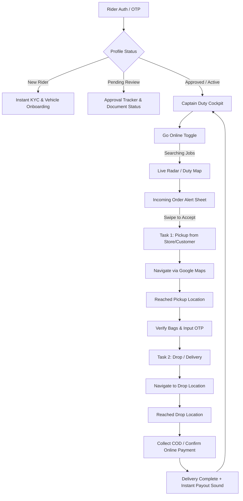

# QuickPress Captain (Rider Panel) — Product Requirements Document (PRD)

**Document Version:** 2.0  
**Target Platform:** Mobile-First Web PWA + Android TWA / APK (Capacitor)  
**Inspiration & Benchmark:** Rapido Captain / Uber Driver / Zepto Rider  
**Theme:** High-Contrast Pure White (`#FFFFFF`) & Rapido Yellow (`#FACC15` / `#FFD200`)

---

## 1. Executive Summary & Vision

QuickPress Captain is the dedicated operating system for delivery partners (captains) fulfilling quick-commerce laundry and dry cleaning pickups and deliveries. Modeled after **Rapido Captain's battle-tested gig-economy UX**, the app is engineered for riders operating on two-wheelers in real-world Indian road conditions: bright sunlight, heavy traffic, one-handed phone mounts, and rapid turnarounds.

### Key Goals:
1. **Instant Clarity & Glanceability**: Zero cognitive load while on a bike. Critical numbers (earnings, distances, client OTPs) readable from 2 feet away.
2. **Duty Cockpit**: Seamless Online/Offline duty toggle with loud sound alerts and vibration.
3. **Swipe-To-Act Ergonomics**: Replaces accidental pocket taps with deliberate swipe gestures (`Swipe to Accept`, `Swipe to Arrive`, `Swipe to Complete`).
4. **Real-Time Earnings & Instant Cashouts**: Real rupee amounts updated immediately on delivery completion, with 1-tap IMPS/UPI bank withdrawal.
5. **Zero Mock/Seed Guarantee**: All tasks, earnings, KYC documents, and profiles sync directly with **Supabase PostgreSQL & FastAPI backend**.

---

## 2. Target Persona & Environment

- **User**: Two-wheeler delivery partner (Bike, Scooter, EV).
- **Physical Context**: Phone mounted on bike handlebar or kept in pocket with headphones connected.
- **Operating Conditions**: Direct sunlight, rainy conditions, night driving, spotty 4G/5G connectivity.
- **Key Needs**:
  - Loud incoming order chime (pierces through street noise).
  - High-contrast pure white UI with bold black text (no washed-out gray tones).
  - Clear pickup vs. delivery store addresses with 1-tap Google Maps launch.
  - Transparent payout calculation (Base Fare + Distance Fare + Wait Time + Surge + 100% Tips).

---

## 3. Product Architecture & Core User Flows

---

## 4. Detailed Feature Specifications

### 4.1. Authentication & Onboarding
- **Phone Login**: Fast 10-digit mobile number entry with instant telecom SMS OTP.
- **Testing Resilience**: Graceful dev code support (`123456`) and direct Supabase database session locking.
- **Smart Routing Guard**:
  - If verified captain 👉 Direct to Cockpit Dashboard (`/dashboard`).
  - If registered but pending admin approval 👉 Direct to Status Tracker (`/registration-submitted`).
  - If new user 👉 Direct to Onboarding Wizard (`/registration`).
- **KYC & Document Verification**:
  - Profile selfie with helmet check.
  - Driving License (DL) & Vehicle Registration Certificate (RC) upload with OCR preview.
  - Bank Account & UPI ID binding for direct transfers.

---

### 4.2. Duty Cockpit (Home / Duty Screen)
- **Top Duty Bar**:
  - Live Online/Offline toggle with tactile state switch.
  - Audio confirmation: Voice prompts ("You are now Online. Finding nearby laundry orders...").
  - Battery & GPS location health indicator.
- **Today's Earnings Card**:
  - Big bold currency display: `₹840` (Today's Total).
  - Sub-metrics: `12 Trips Completed`, `4.8 hrs Online`, `32.4 km Travelled`.
- **Active Hotspot Map / Heatmap**:
  - Visual high-demand clusters around laundry partner hubs.
- **Floating Bottom Action Bar**:
  - Quick access to `Orders Queue`, `Wallet / Payouts`, `History`, `Support`.

---

### 4.3. Incoming Order Dispatch (Rapido-Style Order Card)
- **Audio Chime**: Continuous pulsing alarm sound + heavy vibration pattern until accepted or timed out.
- **Countdown Timer**: 30-second visual radial timer.
- **Key Information Display**:
  - **Guaranteed Earning**: E.g., `₹65` in big bold yellow highlight.
  - **Pickup Spot**: Store name & distance (e.g., `0.8 km away · FreshFold Laundry`).
  - **Drop Spot**: Delivery address & distance (e.g., `2.4 km · Flat 402, Green Valley`).
  - **Total Order Value & Payment Mode**: `Paid Online` or `Cash to Collect: ₹450`.
- **Acceptance Mechanism**:
  - **Swipe to Accept Slider** (Rapido pattern: sliding yellow button from left to right) to prevent false pocket touches.
  - Secondary button: `Decline (Pass to Next Rider)`.

---

### 4.4. Active Trip Execution Lifecycle
Every order follows strict atomic state progression:
1. **`assigned`**: Rider accepted; prompt to start route.
2. **`accepted`**: Navigation route drawn to pickup location with 1-tap "Open in Google Maps".
3. **`reached-partner` / `reached-customer`**: Rider confirms arrival at gate/counter.
4. **`picked-up`**:
   - Verification checklist: Bag count confirmation.
   - 4-digit Customer/Store Handover OTP verification.
5. **`on-the-way`**: Navigation route drawn to customer delivery drop point.
6. **`delivered`**:
   - If COD: Cash collection confirmation dialog with exact change calculation.
   - If Prepaid: Contactless drop photo or delivery OTP.
   - Rewarding audio chime (`Cash Register Ka-Ching` sound) + summary modal showing exact trip payout.

---

### 4.5. Wallet & Instant Payout System
- **Real-Time Balance Ledger**:
  - `Available for Withdrawal`: Real funds ready for cashout.
  - `Today's Earnings`: Trips + Tips + Daily Surge.
- **Instant Bank Transfer**:
  - 1-tap `Withdraw Now` button to linked bank account / UPI ID.
  - Instant IMPS processing confirmation with transaction UTR number.
- **Transparent Ledger History**:
  - Full itemized credit and debit history with date/time stamps.

---

### 4.6. Emergency & Captain Safety (SOS)
- **1-Tap SOS Floating Button**:
  - Instant trigger calling Local Police (112) or QuickPress Operations Emergency Dispatch.
  - Sends immediate GPS location snapshot to operations control room.

---

## 5. Non-Functional Requirements

| Metric | Target SLA |
| :--- | :--- |
| **PWA Bundle Size** | < 1.8 MB (Optimized Vite bundle, gzipped) |
| **First Contentful Paint (FCP)** | < 0.8 seconds on 4G networks |
| **Offline Resilience** | Active order steps cached locally in IndexedDB / localStorage |
| **Touch Ergonomics** | Min 52px button heights, 16px minimum touch spacing |
| **Contrast Ratio** | WCAG AAA compliant (Deep black text `#09090B` on pure white `#FFFFFF`) |
| **Audio Latency** | < 100ms trigger time on incoming order push |

---

## 6. Release Roadmap & Milestones

- **Phase 1 (Cockpit Redesign & Duty State)**: Brand new pure white + Rapido yellow Home Duty Cockpit with Online/Offline audio chimes.
- **Phase 2 (Rapido-Style Swipe Cards)**: Incoming order modal with audio alert and Swipe-to-Accept gesture.
- **Phase 3 (Active Order Stepper)**: Step-by-step pickup/drop lifecycle with Google Maps integration and bag OTP verification.
- **Phase 4 (Wallet & Live Ledger)**: Live Supabase-backed instant wallet with payout history.
